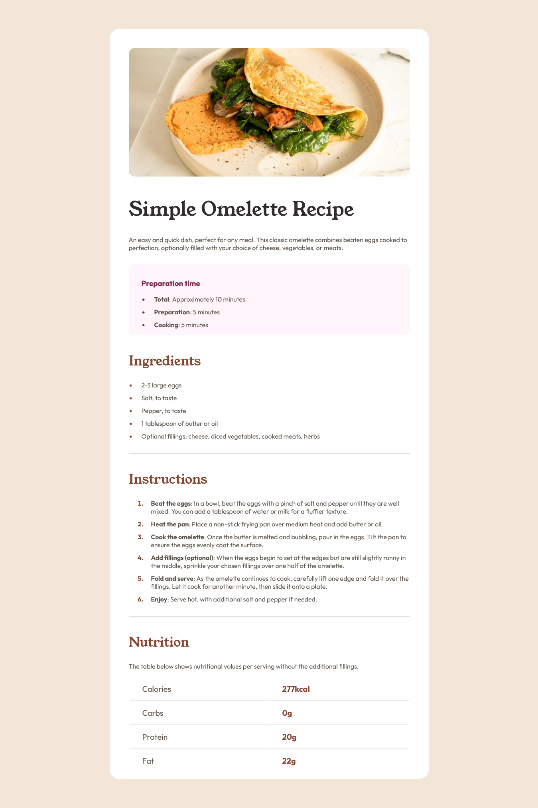
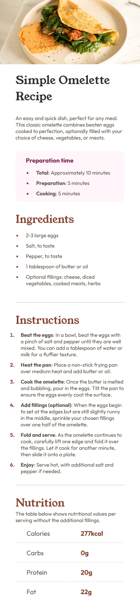

# Frontend Mentor - Recipe page solution

This is a solution to the [Recipe page challenge on Frontend Mentor](https://www.frontendmentor.io/challenges/recipe-page-KiTsR8QQKm). Frontend Mentor challenges help you improve your coding skills by building realistic projects.

## Table of contents

- [Overview](#overview)
  - [Screenshot](#screenshot)
  - [Links](#links)
- [My process](#my-process)
  - [Built with](#built-with)
- [Author](#author)

## Overview

### Screenshot

Desktop Version:

Mobile Version:

### Links

- Solution URL: [GitHub](https://github.com/0x1Ox1d3/recipe-page-frontend-mentor)
- Live Site URL: [Netlify](https://recipe-page-front-end-mentor.netlify.app/)

## My process

### Built with

- Semantic HTML5 markup
- CSS custom properties
- Flexbox

## Author

- Frontend Mentor - [@0x1Ox1d3](https://www.frontendmentor.io/profile/0x1Ox1d3)
- Twitter - [@Oxy_oxide](https://twitter.com/Oxy_oxide/)
